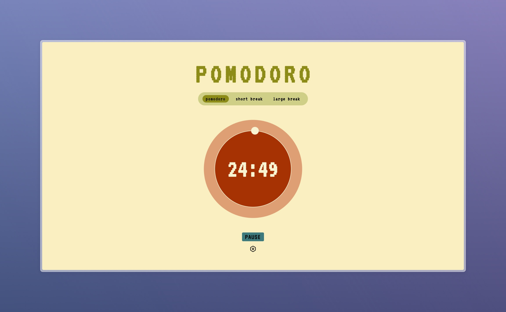

# Pomodoro Timer

## Overview
This project is a simple Pomodoro Timer web application built using HTML, CSS, and JavaScript. The Pomodoro Technique is a time management method developed by Francesco Cirillo in the late 1980s. It uses a timer to break down work into intervals, traditionally 25 minutes in length, separated by short breaks.

## How to Use
1. Click [here](https://your-username.github.io/pomodoro-timer/) to open the Pomodoro Timer web application.

## Technologies Used
- HTML: Used for structuring the web page.
- CSS: Used for styling the user interface.
- JavaScript: Used for implementing the timer functionality and handling user interactions.

## Features
- Customizable work and break durations.
- Start, pause, and reset functionality.
- Visual and audible alerts when a session ends.
- Simple and intuitive user interface.

## Future Improvements
- Implement a history feature to keep track of completed sessions.
- Add the ability to customize the timer alert sound.
- Implement a dark mode option.
- Add keyboard shortcuts for controlling the timer.
- Improve the responsiveness of the web application.
- Improve the menu settings.